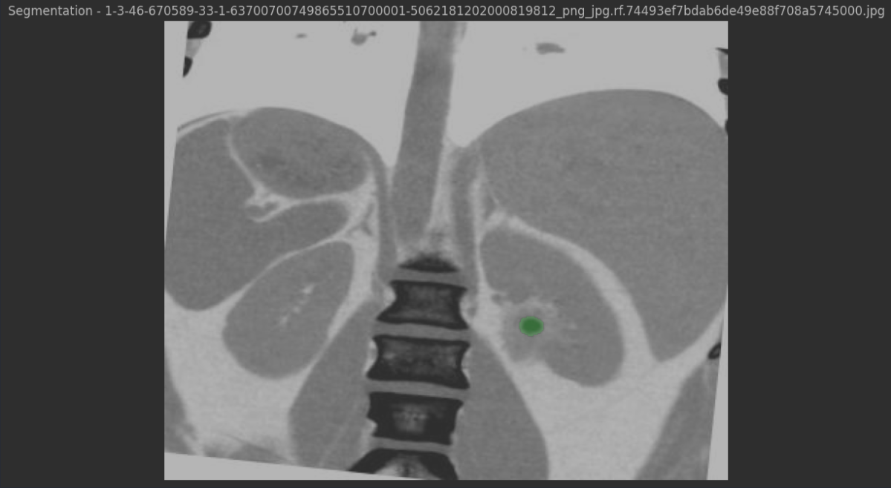
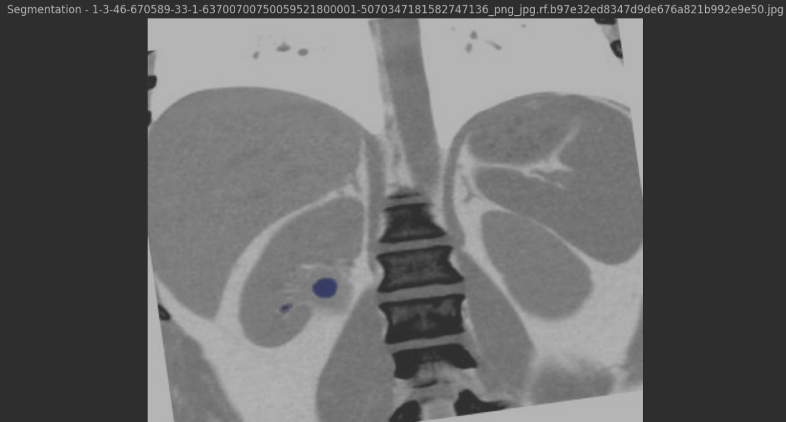
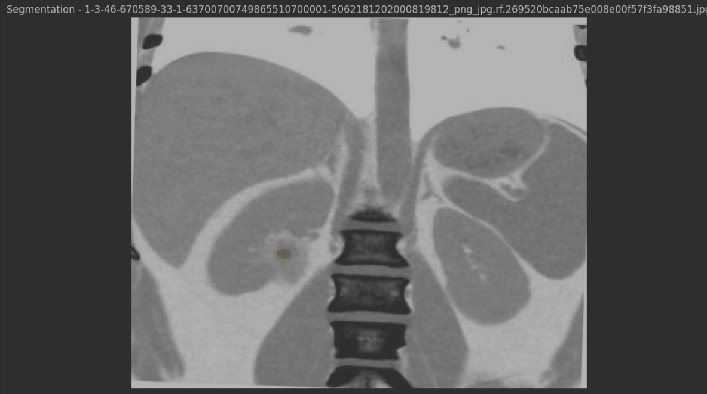

# KidneyStoneSegmentation

A deep learning-based project for kidney stone segmentation using SAM (Segment Anything Model) and YOLO-labeled images. This tool provides a pipeline for processing, segmenting, and visualizing kidney stone images, supporting medical imaging tasks related to kidney stone detection and analysis.

## Table of Contents

- [About the Project](#about-the-project)
- [Features](#features)
- [Project Structure](#project-structure)
- [Getting Started](#getting-started)
  - [Prerequisites](#prerequisites)
  - [Installation](#installation)
- [Usage](#usage)
- [Results](#results)
- [Contributing](#contributing)
- [License](#license)
- [Contact](#contact)

---

## About the Project

This project uses deep learning techniques for the segmentation of kidney stones from medical images. By leveraging the SAM (Segment Anything Model) and YOLO-labeled images, it provides an efficient and robust method for processing and visualizing kidney stone data. This tool aims to aid in the diagnosis, analysis, and research of kidney stones through advanced image segmentation.

## Features

- **Deep Learning-Based Segmentation**: Uses SAM (Segment Anything Model) for accurate segmentation.
- **YOLO-Labeled Images**: Supports images labeled with YOLO format, making it compatible with common object detection datasets.
- **Flexible Data Handling**: Processes training, testing, and validation datasets stored in the `data/` directory.
- **Visualization**: Provides a visualization of segmented kidney stones for better interpretability and validation.

## Project Structure

```plaintext
KidneyStoneSegmentation/
├── data/                      # Folder for datasets (train, test, valid)
│   ├── train/
│   │   ├── images/
│   │   └── labels/
│   ├── test/
│   └── valid/
├── notebook/                  # Jupyter notebooks for experiments
│   └── Kidney_Stone.ipynb
├── results/                   # Folder for storing output images
├── src/                       # Source files for model and utility functions
│   ├── main.py                # Main script to run segmentation
│   ├── segmentation.py        # Contains SAM model loading and prediction functions
│   └── utils.py               # Helper functions for processing images and data
├── .gitignore                 # Git ignore file to exclude unnecessary files
├── requirements.txt           # Python package dependencies
├── LICENSE                    # License for the project
└── README.md                  # Project documentation
```
# Getting Started

To get a local copy up and running, follow these steps.

## Prerequisites

Ensure you have Python 3.7 or higher installed. This project also requires pip for managing Python packages.

## Installation

1. **Clone the repository**  

   ```bash
   git clone https://github.com/berkaykaratas07/KidneyStoneSegmentation.git
   cd KidneyStoneSegmentation
   ```

2. **Create a virtual environment**

      ```bash
      python -m venv .venv
      source .venv/bin/activate       # On Windows, use `.venv\Scripts\activate
     ```

3. **Install dependencies**

      ```bash
      pip install -r requirements.txt
      ```

3. **Download the SAM checkpoint file**
 - Place the sam_vit_h_4b8939.pth model checkpoint file in the root directory. This file is required for the SAM model to work.

# Usage

To run the segmentation pipeline on kidney stone images, you can use either `main.py` or the provided notebook.

## Running from Command Line

To process images in the `data/` folder, run:

```bash
python src/main.py
```

## Using the Jupyter Notebook

Open the Kidney_Stone.ipynb notebook in the notebook/ folder to experiment interactively:

```bash
jupyter notebook notebook/Kidney_Stone.ipynb
```

## Customizing Data and Parameters

Place your training, testing, and validation images in the respective folders:

- `data/train`: For training images and labels.
- `data/test`: For testing images and labels.
- `data/valid`: For validation images and labels.

Additionally, update the model checkpoint path or any other parameters as needed in `src/main.py` to ensure the script runs with the correct configurations.

## Results

After running the segmentation, output images with kidney stone segmentation overlays will be saved in the `results/` folder. These images provide a visual representation of the model's performance.

### Sample Output

Below are examples of segmented kidney stone images generated by the model:





These sample outputs demonstrate the model's ability to accurately detect and segment kidney stones from the input images.

## Contributing

Contributions are welcome! If you'd like to improve this project, please follow these steps:

1. Fork the project.
2. Create your feature branch (`git checkout -b feature/YourFeature`).
3. Commit your changes (`git commit -m 'Add some feature'`).
4. Push to the branch (`git push origin feature/YourFeature`).
5. Open a pull request.

Please ensure your code follows the project’s coding style and includes relevant tests to ensure compatibility and reliability.

## License

Distributed under the MIT License. See `LICENSE` for more information.

## Contact

For any inquiries or further information, you can contact me:

- **Berkay Karataş** - berkaykaratas054@gmail.com

Project Link: [https://github.com/berkaykaratas07/KidneyStoneSegmentation](https://github.com/berkaykaratas07/KidneyStoneSegmentation)

## Acknowledgements

The kidney stone images used in this project were sourced from the following dataset on Kaggle:

- [Kidney Stone Images Dataset by Safura Hajiheidari](https://www.kaggle.com/datasets/safurahajiheidari/kidney-stone-images)

Special thanks to the dataset author for making these images available, which helped in developing and testing this segmentation model.


